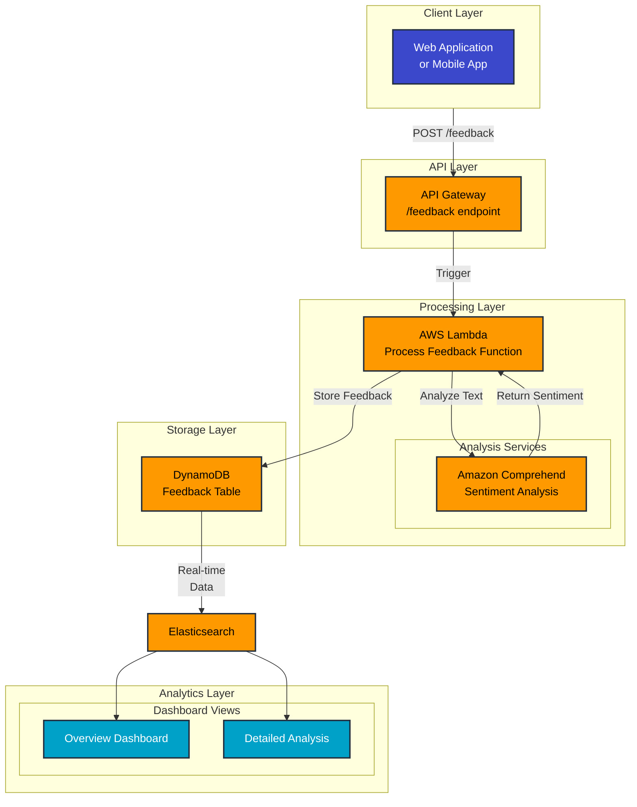

# AWS Customer Feedback Analysis System

## Project Overview

This project implements a real-time customer feedback analysis system using AWS services. It helps businesses automatically collect, analyze, and visualize customer feedback data, enabling faster response times and data-driven decision making. The system is particularly valuable for organizations dealing with high volumes of customer feedback that require immediate insights.

## Business Value

- **Real-time Analysis**: Automatically process customer feedback as it arrives, eliminating manual analysis bottlenecks
- **Consistent Evaluation**: Apply standardized sentiment analysis across all feedback
- **Quick Issue Detection**: Identify and escalate critical customer concerns immediately
- **Data-Driven Insights**: Generate actionable business intelligence through automated dashboard visualizations
- **Scalable Solution**: Handle varying volumes of feedback with AWS's elastic infrastructure

## Architecture



## AWS Services Used

- **Amazon API Gateway**: Handles feedback submission and review retrieval through RESTful APIs
- **AWS Lambda**: Processes incoming feedback and orchestrates the analysis workflow
- **Amazon DynamoDB**: Provides fast, scalable storage for structured feedback data
- **Amazon Comprehend**: Performs natural language processing for sentiment analysis and key phrase extraction
- **Elastic Stack**: Creates interactive dashboards for data visualization
- **AWS CloudFormation**: Manages infrastructure as code for consistent deployments

## Prerequisites

Before starting, ensure you have:

- An active AWS Account with appropriate permissions
- Node.js and npm installed (for CDK development and Real-Time Reviews Web App)
- AWS CDK CLI installed
- Python 3.9 or higher
- Elastic Stack deployment (Elasticsearch and Kibana)
- AWS SSO configured (for deployment)

## Deployment Instructions

### 1. Deploy AWS Infrastructure

Navigate to the CDK project directory:
```bash
cd /cdk-user-feedback
```

Configure environment:
```bash
cp .env.example .env
# Edit .env to set your Elasticsearch endpoint
```

Set up AWS SSO:
```bash
# Configure SSO profile
aws sso configure --profile my-sso-profile

# Verify configuration
aws configure list-profiles
cat ~/.aws/config
aws sts get-caller-identity --profile your-aws-sso-profile

# Log in to AWS
aws sso login --profile your-aws-sso-profile
```

Deploy the stack:
```bash
# Bootstrap CDK
./bootstrap.sh your-aws-sso-profile dev

# Deploy
./deploy.sh your-aws-sso-profile dev
```

### 2. Load Sample Data

Navigate to the data loader directory:
```bash
cd /user-feedback-simulator/data-loader

# Configure environment
cp .env.example .env
# Edit .env to set AWS profile, region, and DynamoDB table name if needed

# Set up Python environment
python -m venv venv
source venv/bin/activate
pip install -r requirements.txt

# Load sample data
python load_reviews.py
```

### 3. Run the Feedback Simulator


```bash
cd /user-feedback-simulator
cp .env.example .env
# Edit .env to set your API GW Endpoints
npm install
npm run dev
```

Access the simulator at http://localhost:5173/

### 4. Verify Data Flow

1. Check DynamoDB Records:
   - Go to AWS Console > DynamoDB
   - Find the 'FeedbackTable' table
   - Select "Explore table items"
   - Verify that review records are present

2. Verify Elasticsearch Integration:
   - Access your Elasticsearch cluster endpoint
   - Use Kibana Dev Tools or curl to check the 'sentiment' index:
     ```bash
     # Replace with your Elasticsearch endpoint and index name
     curl -X GET "https://your-elasticsearch-endpoint/sentiment/_count"
     ```
   - Verify records are being indexed

3. Set Up Kibana Dashboards:
   - Log in to your Kibana instance
   - Navigate to Stack Management > Index Patterns
   - Create an index pattern for your feedback data
   - Go to Dashboard section to create visualizations
   - Suggested visualizations:
     - Sentiment trends over time
     - Feedback volume by category
     - Top keywords from reviews
     - Average ratings distribution

## Sample Data

This project uses the Women's E-Commerce Clothing Reviews dataset from Kaggle for demonstration purposes. You can find the dataset at:
https://www.kaggle.com/datasets/nicapotato/womens-ecommerce-clothing-reviews

## Troubleshooting

- Verify AWS SSO login status if deployment fails
- Check AWS Console for service deployment status and CloudWatch logs
- Ensure all environment variables are properly set in .env files
- Confirm Elasticsearch endpoint is accessible from your VPC

## Contributing

Please read our contributing guidelines before submitting pull requests. Ensure all tests pass and code meets our style guidelines.

## License

Licensed under the Apache License, Version 2.0 (the "License");
you may not use this file except in compliance with the License.
You may obtain a copy of the License at

    http://www.apache.org/licenses/LICENSE-2.0

Unless required by applicable law or agreed to in writing, software
distributed under the License is distributed on an "AS IS" BASIS,
WITHOUT WARRANTIES OR CONDITIONS OF ANY KIND, either express or implied.
See the License for the specific language governing permissions and
limitations under the License.

Copyright 2024 Schmitech Inc.